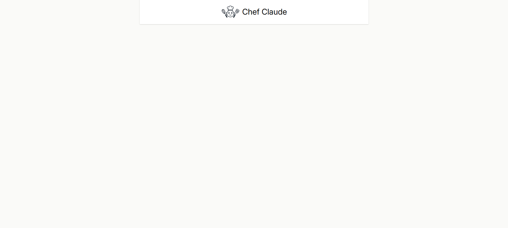
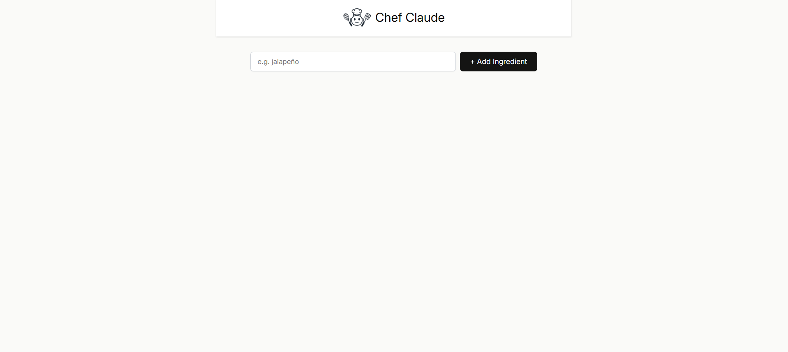
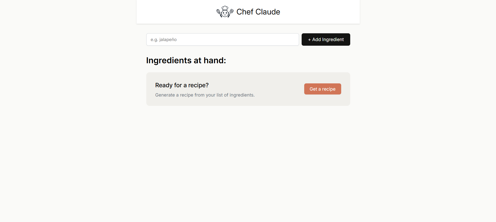
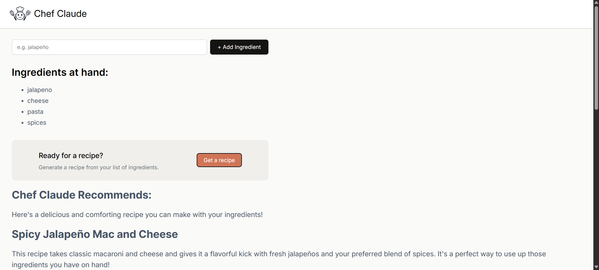
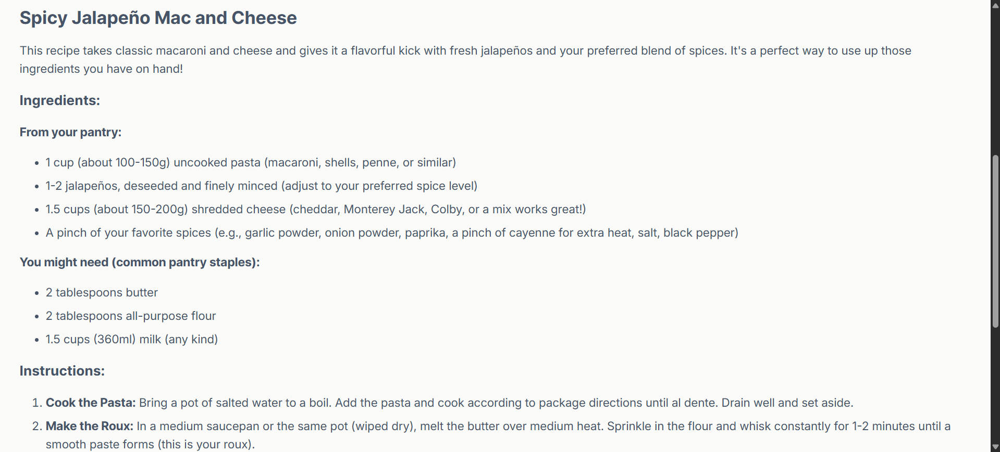
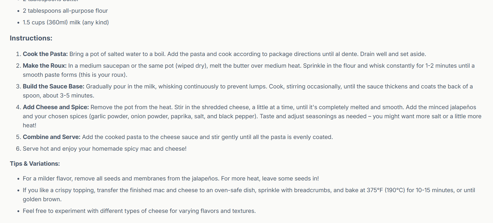

# Chef Claude (Built with Gemini API) (screenshots below)

Live Demo: https://chef-claude-by-harshil.vercel.app/

**Note:** Even though the name is “Chef Claude”, I didn’t use the Anthropic Claude API (it's paid). Instead, the app uses the Gemini API to generate recipes. Everything in this project: UI, logic, forms, and the serverless backend, was written fully by hand without AI-generated code.


## Overview

Chef Claude is a small React application designed to generate cooking recipes based on the ingredients provided by the user. 
<br> 
<br> 
The project was built to practice state management, conditional rendering, and API calls using a secure backend route rather than exposing the key in the frontend.

The UI follows a simple flow:
1. User enters ingredients
2. Ingredients appear dynamically in a list
3. User submits form
4. A recipe is generated through the Gemini API and displayed in the UI


## Features

- Dynamic list rendering of ingredients
- Controlled React form using `useState`
- Conditional UI states (empty, loading, result)
- Simple AI recipe generation using Gemini API
- Separate serverless function to keep API key secure
- Component-based structure with clean CSS organization
- Fully handwritten for learning, no AI code generation or auto-code

## Tech Stack

- React (useState, controlled inputs, props)
- Vite (bundler + dev server)
- JavaScript (ES6+)
- Serverless function via Vercel (`api/generateRecipe.js`)
- Gemini API for recipe generation


## Key Concepts Practiced

This project helped reinforce a significant part of my React learning:

- Props vs state
- Updating complex state (arrays and objects)
- Controlled forms with text input, radio, textarea, and select
- Conditional rendering (`&&`, ternary, return shortcuts)
- Lifting state and passing data between components
- Dynamic styles based on UI state
- Mapping over arrays to generate repeated UI elements
- Separating logic into reusable components


## API Handling & Security

Instead of calling the Gemini API directly from the frontend (which would expose the API key), I used a **serverless backend function** via Vercel:

- `api/generateRecipe.js` receives the POST request
- The serverless function reads the API key from environment variables (`.env.local`)
- It forwards the request to Gemini, receives the recipe, formats it, and returns it to the frontend

This setup allows the project to behave like a full-stack app without needing a separate backend server.

## Screenshots

### Header and initial layout


### Ingredients Input Field added


### CTA added / UI taking shape


### Final generated recipe view





## File Structure

```
src/
 ├─ assets/
 │   └─ logo.png
 ├─ components/
 │   ├─ Header.jsx
 │   ├─ Header.css
 │   ├─ Main.jsx
 │   ├─ Main.css
 │   ├─ IngredientsList.jsx
 │   ├─ ClaudeRecipe.jsx
 ├─ App.jsx
 ├─ App.css
 ├─ index.css
 └─ main.jsx

api/
 └─ generateRecipe.js

public/
 ├─ 1_headerDone.png
 ├─ 2_inputAdded.png
 ├─ 3_ctaAdded.png
 ├─ 4.1_recipedone.png
 ├─ 4.2_recipedone.png
 ├─ 4.3_recipedone.png
 └─ vite.svg
```


## Running the Project Locally

Install dependencies:

```
npm install
```

Create a `.env.local` file and add:

```
GEMINI_API_KEY=your_key_here
```

Start development server:

```
npm run dev
```


